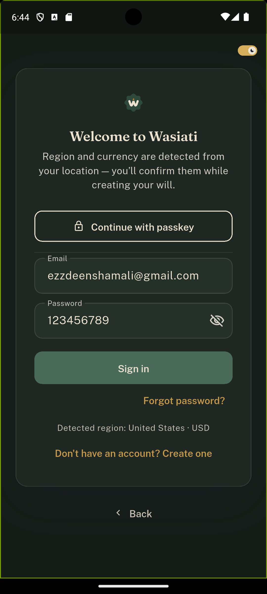
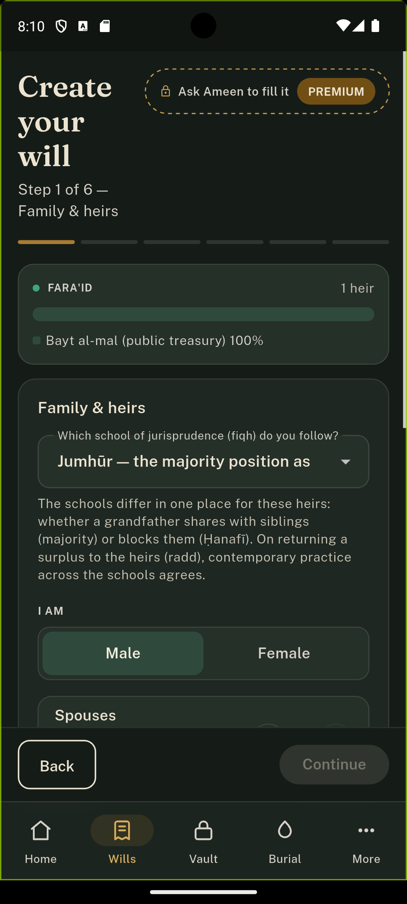
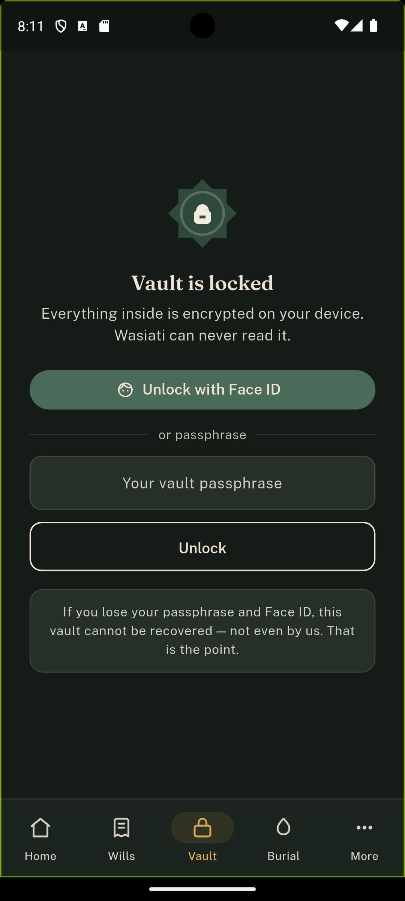
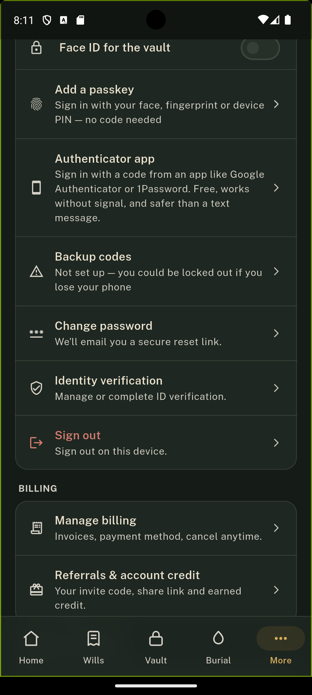

# Wasiati (وصيتي)

A digital Islamic will platform for Muslim communities in North America — helping users create a Sharia-compliant will (wasiyya), calculate Fara'id (Islamic inheritance shares) across different schools of jurisprudence, securely store important documents, and manage trustees, witnesses, and heirs.

Wasiati is a commercial product — I worked on the Flutter frontend as part of a paid team engagement.

## My Role

This is a team project. My contribution was the Flutter frontend application, located at app/apps/wasiati](./app/apps/wasiati). The backend (NestJS/Prisma), infrastructure (Terraform), and landing page were built by other team members. This repository is shared as a full monorepo with the team's permission to showcase the complete product.

## Screenshots

| Sign in | Create Will — Fara'id | Vault | Security Settings |
|---|---|---|---|
|  |  |  |  |

## Flutter App — Key Features

- Islamic Will Creation — step-by-step will builder with live Fara'id (inheritance share) calculation, supporting multiple schools of jurisprudence (Jumhūr / Ḥanafī)
- - Passkey / WebAuthn Authentication — passwordless sign-in alongside traditional email/password
  - - Encrypted Vault — client-side encrypted storage for sensitive documents and passwords; not even the backend can read it
    - - Heir, Witness & Trustee Management — structured contact and confirmation flows
      - - Death Claims & Burial Services — claim submission and burial quote requests
        - - AI Intake Assistant — guided will-filling assistant ("Ameen")
          - - Billing & Subscriptions — Stripe-based pricing and entitlements
            - - Bilingual — full Arabic/English localization (RTL supported)
              - - Light & Dark Themes
               
                - ## Architecture
               
                - The Flutter app follows Clean Architecture with a clear feature-based structure:
               
                - ```
                  lib/
                  ├── core/           # routing, network (Dio), theming, storage, l10n
                  ├── features/       # 20+ features, each split into:
                  │   ├── data/           # API clients
                  │   ├── domain/         # models, business rules
                  │   ├── application/    # Riverpod providers/state
                  │   └── presentation/   # screens & widgets
                  └── l10n/           # Arabic & English translations
                  ```

                  Each feature auth, wills, vault, commerce, death_claims, burial, zakat, identity, referrals, etc.) is self-contained and independently testable.

                  ## Tech Stack (Flutter app)

                  - State management: Riverpod (with code generation)
                  - - Routing: go_router
                    - - Networking: Dio
                      - - Auth: Passkey/WebAuthn, Google Sign-In, JWT
                        - - Storage: flutter_secure_storage, shared_preferences
                          - - Encryption: cryptography package (client-side vault encryption)
                            - - Media: camera, video_player, speech_to_text, flutter_tts
                              - - Documents: PDF generation/export printing, file_saver)
                                - - Charts: fl_chart
                                  - - Code generation: Freezed, json_serializable, riverpod_generator
                                   
                                    - ## Full Monorepo Structure
                                   
                                    - ```
                                      Wasiati/
                                      ├── app/          # Flutter application (my contribution)
                                      ├── backend/      # NestJS + Prisma + PostgreSQL
                                      ├── infra/        # Terraform infrastructure
                                      └── landing/      # Marketing landing page
                                      ```

                                      The backend exposes REST endpoints (e.g. /payments/webhook, /files/presign) and integrates Stripe, Redis, and MinIO/S3 for file storage.

                                      ## Running the Flutter App Locally

                                      ```bash
                                      cd app/apps/wasiati
                                      flutter pub get
                                      flutter run
                                      ```

                                      > Note: the app depends on the backend API being reachable (see lib/core/config/env.dart for the expected environment variables). Some features will not load without a running backend instance.
                                      >
                                      > ## Contact
                                      >
                                      > Built by Ezzdeen Shamaly and team.
